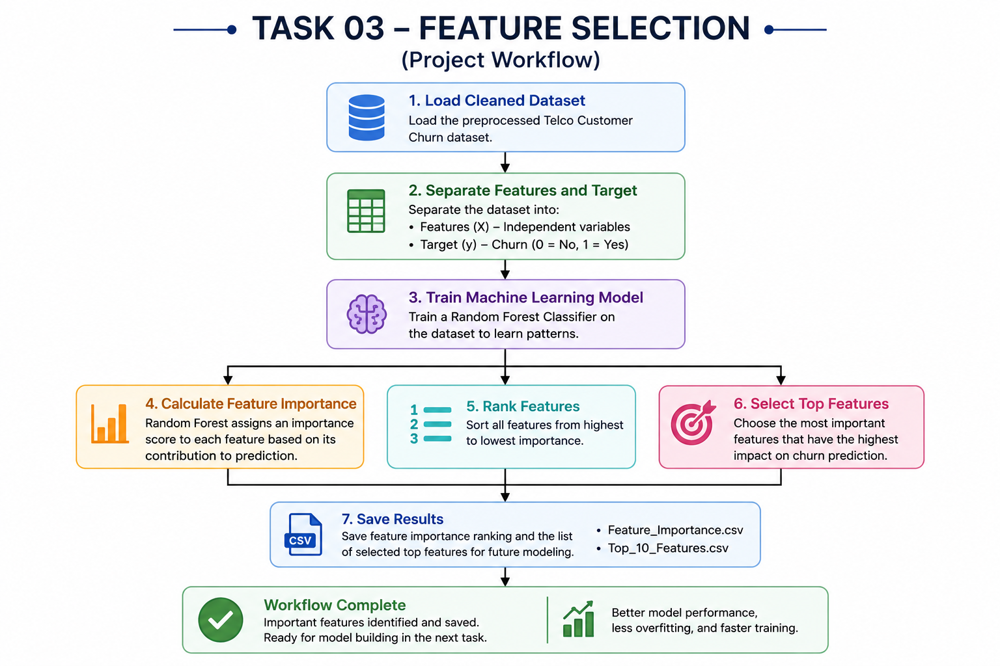
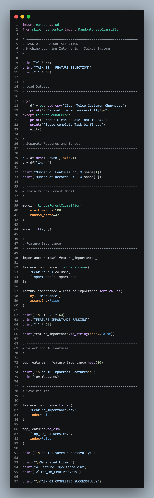
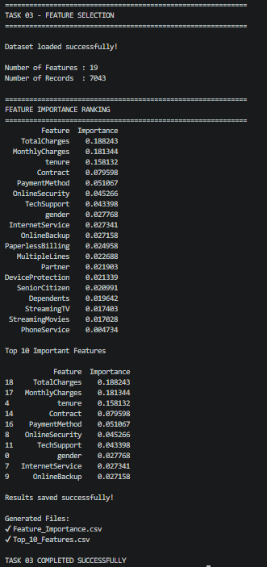

# 📊 Task 03 – Feature Selection for Customer Churn Prediction

<p align="center">


</p>

---

# 📌 Machine Learning Internship Project

**Organization:** Saiket Systems

**Role:** Machine Learning Intern

**Task:** Task 03 – Feature Selection

---

# 📖 Project Overview

Feature Selection is one of the most important stages of the Machine Learning pipeline. It involves identifying the most relevant input features that significantly influence the prediction of the target variable.

In this project, I analyzed the **Telco Customer Churn Dataset** to determine which customer attributes have the greatest impact on predicting customer churn. Instead of using every available feature, I ranked them based on their importance using the **Random Forest Classifier**.

Selecting relevant features helps improve model performance, reduce computational cost, minimize overfitting, and make machine learning models easier to interpret.

---

# 🎯 Objectives

* Load the cleaned Telco Customer Churn dataset.
* Separate Features (X) and Target Variable (y).
* Analyze feature importance using Random Forest.
* Rank all features based on importance.
* Identify the top influential features affecting customer churn.
* Save the feature importance results for future model development.

---

# 📂 Dataset Information

**Dataset:** Telco Customer Churn Dataset

The dataset contains customer information such as:

* Customer Demographics
* Internet Services
* Contract Type
* Payment Methods
* Monthly Charges
* Tenure
* Technical Support
* Online Security
* Customer Churn Status

### 🎯 Target Variable

| Value | Description      |
| ----- | ---------------- |
| 1     | Customer Churned |
| 0     | Customer Stayed  |

---

# 🛠️ Technologies Used

* Python
* Pandas
* Scikit-learn
* Random Forest Classifier

---

# 📚 Libraries Used

```python
import pandas as pd
from sklearn.ensemble import RandomForestClassifier
```

---

# 🖼️ Project Workflow

<p align="center">

</p>

---

# 📸 Project Screenshots

## 💻 Python Code

<p align="center">

</p>

---

## 🖥️ Program Output

<p align="center">

</p>

---

# 🔄 Machine Learning Workflow

```text
Clean Dataset
      │
      ▼
Load Dataset
      │
      ▼
Separate Features (X)
      │
      ▼
Separate Target (y)
      │
      ▼
Train Random Forest Model
      │
      ▼
Calculate Feature Importance
      │
      ▼
Rank Features
      │
      ▼
Select Top Features
      │
      ▼
Save Results
```

---

# ⚙️ Project Workflow

### Step 1 – Load Dataset

Load the cleaned dataset generated during Task 01.

---

### Step 2 – Separate Features and Target

* Features (X)
* Target Variable (y)

---

### Step 3 – Train Random Forest Model

Train a Random Forest Classifier to evaluate the importance of each feature.

---

### Step 4 – Calculate Feature Importance

The model assigns an importance score to every feature based on its contribution to predicting customer churn.

---

### Step 5 – Rank Features

Sort all features from highest importance to lowest importance.

---

### Step 6 – Save Results

Generate:

* Feature_Importance.csv
* Top_10_Features.csv

---

# 📊 Example Feature Importance Ranking

| Rank | Feature          | Importance |
| ---- | ---------------- | ---------: |
| 1    | Contract         |       0.24 |
| 2    | Tenure           |       0.19 |
| 3    | MonthlyCharges   |       0.17 |
| 4    | OnlineSecurity   |       0.10 |
| 5    | TechSupport      |       0.08 |
| 6    | InternetService  |       0.06 |
| 7    | PaymentMethod    |       0.05 |
| 8    | OnlineBackup     |       0.04 |
| 9    | DeviceProtection |       0.03 |
| 10   | PaperlessBilling |       0.02 |

---

# 💡 Why Feature Selection?

Feature Selection helps to:

* Improve model accuracy
* Reduce training time
* Remove irrelevant features
* Reduce overfitting
* Improve model interpretability
* Increase computational efficiency

---

# 📁 Project Structure

```text
Task-03/
│
├── images/
│   ├── workflow.png
│   ├── code.png
│   └── output.png
│
├── task-03.py
├── README.md
├── Clean_Telco_Customer_Churn.csv
├── Feature_Importance.csv
└── Top_10_Features.csv
```

---

# ▶️ Installation

```bash
git clone https://github.com/your-username/Task-03.git

cd Task-03

pip install pandas scikit-learn
```

---

# ▶️ Run the Project

```bash
python task-03.py
```

---

# ✅ Expected Output

```text
Dataset loaded successfully!

Number of Features : 19

Number of Records : 7043

======================================

FEATURE IMPORTANCE RANKING

======================================

Contract               0.24
Tenure                 0.19
MonthlyCharges         0.17
OnlineSecurity         0.10
TechSupport            0.08
...

Results saved successfully!

Feature_Importance.csv

Top_10_Features.csv

TASK 03 COMPLETED SUCCESSFULLY
```

---

# 🚀 Skills Demonstrated

* Feature Selection
* Feature Importance Analysis
* Random Forest
* Machine Learning Fundamentals
* Data Analysis
* Python Programming
* Pandas
* Scikit-learn

---

# 📚 Learning Outcomes

After completing this project, I learned:

* The importance of selecting relevant features.
* How Random Forest calculates feature importance.
* Ranking features based on predictive power.
* Preparing optimized datasets for machine learning.
* Improving model efficiency by removing less relevant attributes.

---

# 🚀 Future Scope

The selected features will be used in the next stages of the Machine Learning pipeline to:

* Train classification models
* Compare different algorithms
* Improve prediction accuracy
* Predict customer churn more effectively

---

# 🙏 Acknowledgement

This project was completed as **Task 03** during my **Machine Learning Internship at Saiket Systems**. It provided valuable practical experience in feature engineering and strengthened my understanding of data preparation for machine learning.

---

# 👨‍💻 Author

**Shaikh Danish**

Machine Learning Intern | AI & ML Enthusiast

* 🌐 GitHub: [https://github.com/YourUsername](https://github.com/SKDANISHO7)
* 💼 LinkedIn: [https://linkedin.com/in/YourProfile](https://www.linkedin.com/in/shaikh-danish-70879328a)

---

<p align="center">

⭐ If you found this project useful, consider giving this repository a **Star**!

</p>
